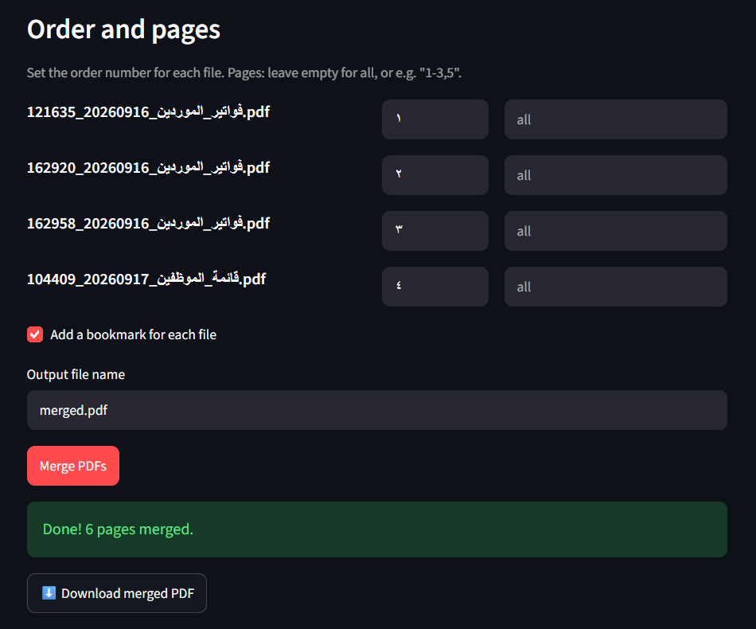

# 📄 PDF Merger


A Python tool to merge multiple PDF files into one. It runs as a **web app**, a **desktop app**, or from the **command line**, all powered by the same core logic.

أداة بايثون لدمج عدة ملفات PDF في ملف واحد، تعمل كموقع ويب، وكتطبيق سطح مكتب، ومن سطر الأوامر.

### 🌐 [Try the live demo](https://YOUR-APP-LINK.streamlit.app)



## Features

- Merge any number of PDF files in the order you choose
- Select specific pages from each file (for example `1-3,5,8-`)
- Automatic bookmark for each source file in the merged PDF
- Clear error messages for missing files, password-protected PDFs, and invalid page ranges
- Three interfaces sharing one core module: web (Streamlit), desktop (Tkinter), and CLI
- Unit tests with pytest

## Tech stack

| Part | Technology |
|------|------------|
| PDF processing | [pypdf](https://pypi.org/project/pypdf/) |
| Web app | [Streamlit](https://streamlit.io/) |
| Desktop app | Tkinter |
| Testing | pytest |

## Installation

```bash
git clone https://github.com/YOUR-USERNAME/pdf-merger.git
cd pdf-merger
python -m venv .venv
```

Activate the virtual environment:

```bash
# Windows
.venv\Scripts\activate

# macOS / Linux
source .venv/bin/activate
```

Install the project and its dependencies:

```bash
python -m pip install -r requirements.txt
python -m pip install -e .
```

## Usage

### Web app

```bash
python -m streamlit run app.py
```

Then open `http://localhost:8501` in your browser.

### Desktop app

```bash
python -m pdf_merger --gui
```

### Command line

```bash
# Merge all pages of both files
python -m pdf_merger report.pdf invoice.pdf -o merged.pdf

# Pages 1-3 from the first file, all pages from the second
python -m pdf_merger report.pdf invoice.pdf -o merged.pdf --pages "1-3" all

# Show all options
python -m pdf_merger --help
```

## Project structure

```
pdf-merger/
├── app.py                 # Streamlit web app
├── src/pdf_merger/
│   ├── core.py            # Merge logic (no UI code)
│   ├── cli.py             # Command-line interface
│   └── gui.py             # Tkinter desktop app
├── tests/
│   └── test_core.py       # Unit tests
├── requirements.txt
└── pyproject.toml
```

The merge logic lives in `core.py` and has no dependency on any interface, so the web app, desktop app, and CLI all reuse it without duplicating code.

## Running tests

```bash
python -m pip install -r requirements-dev.txt
python -m pytest
```

## Privacy

Uploaded files are processed in a temporary folder that is deleted right after the merge. Nothing is stored on the server.

## Roadmap

- [ ] Drag-and-drop file ordering
- [ ] Split a PDF into multiple files
- [ ] Standalone Windows executable (PyInstaller)

## Author

**Narjes Al-Omari**
GitHub: [@YOUR-USERNAME](https://github.com/YOUR-USERNAME)

## License

This project is licensed under the MIT License. See [LICENSE](LICENSE) for details.
